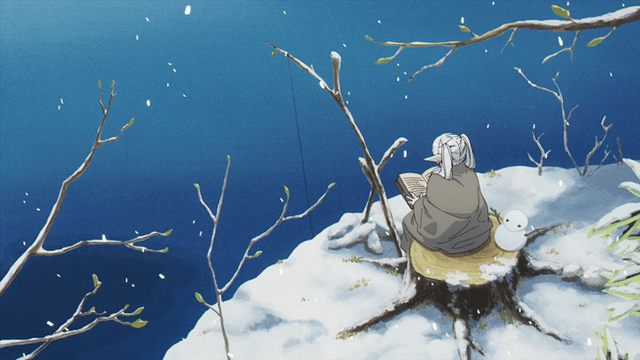

  

# E aí! Eu sou o Bryan. 

Tenho 17 anos e estou dando meus primeiros passos na programação. Sempre tive curiosidade por tecnologia e resolvi aprender a programar para entender melhor como tudo funciona e transformar minhas ideias em projetos.

Ainda estou aprendendo bastante, então este GitHub vai acompanhar minha evolução. Aqui você vai encontrar meus estudos, exercícios e projetos conforme eu for adquirindo mais experiência.

Espero olhar para esse perfil daqui a alguns anos e ver o quanto evoluí.
 
#

<h3 align="left">Connect with me!</h3>

<h3 align="left">My Stack ~</h3>

 </img>
 
 

<h3 align="left">GitHub Stats</h3>

  

<picture>
  <source media="(prefers-color-scheme: dark)" srcset="https://raw.githubusercontent.com/zzzozid/zzzozid/output/pacman-contribution-graph-dark.svg">
  <source media="(prefers-color-scheme: light)" srcset="https://raw.githubusercontent.com/zzzozid/zzzozid/output/pacman-contribution-graph.svg">
  
</picture>

